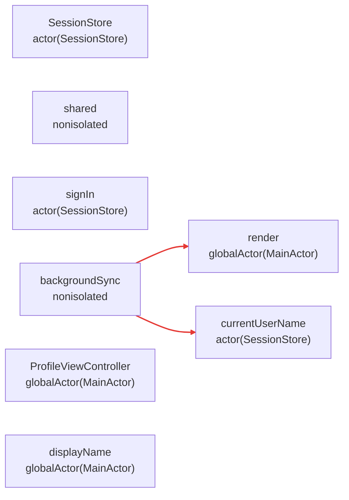

# swift-isolation-map

A static analysis CLI for Swift actor isolation and data-race risk — a whole-project isolation
map, not a single runtime trace.

> **Status: working.** The full pipeline is implemented and tested — project/scheme resolution,
> index-store discovery and staleness detection, a hybrid `libIndexStore` + `SwiftSyntax`
> inference engine, and an external-isolation oracle that resolves compiled-dependency symbols
> (CocoaPods, XCFrameworks, SDK frameworks) via bulk `symbolgraph-extract` and, as a fallback, live
> `sourcekitd` queries. 246 tests passing (`swift test`), continuously validated against two real,
> independent projects (one private, ~1450 source files across 42 CocoaPods + 9 SPM dependencies;
> one public), not just fixtures. `mermaid`/`dot`/`json` output all ship. Not yet built: the `v0.2`
> items below (`diff` subcommand, GitHub Action, migration-debt map).

## Quick start

No packaged distribution yet (Homebrew/SPM-plugin are `v0.2`+, see Roadmap below) — build from
source:

```
git clone https://github.com/btctcn/swift-isolation-map.git
cd swift-isolation-map
swift build -c release
.build/release/swift-isolation-map --help
```

See [Usage](#usage) below for the full flag reference, or
[`CONTRIBUTING.md`](CONTRIBUTING.md) for running the test suite and opening the package in Xcode.

## The problem

Swift 6's strict concurrency checking turned actor isolation violations into hard compiler errors. Developers migrating legacy codebases hit opaque errors like `Sending value risks data race` with no architectural context for *why* the boundary is unsafe, and no tool that shows the isolation structure of the whole project at once.

Xcode Instruments visualizes actor hops, but only as a **runtime trace of one specific run** — it doesn't cover the whole codebase statically, and it requires exercising the relevant code path first. Compiler diagnostics are bare, with no architectural framing. `swift-isolation-map` fills that gap:

1. Static analysis of the whole project, not a runtime trace of one run
2. An architectural map (the full isolation-domain graph), not a single-run timeline
3. Explains *why* an isolation boundary is risky, in architectural context — not just *what* happened
4. CI-suitable — can be embedded as a pipeline gate, which a runtime trace cannot
5. A migration-debt map, trackable over time via git history

## Compiler diagnostics: a concrete look

It's easy to assert that `Sending value risks data races` is uninformative;
here's what actually happens when you compile three progressively-realistic
reproductions under Swift 6.3 strict concurrency. The diagnostic is precise
when the unsafe access is in the same function as the `send` — it names the
exact conflicting line. The moment the `send` crosses a function boundary
(a helper call, a `Task { }` closure), the diagnostic still correctly fires,
but stops pointing at the access it actually conflicts with, and can't rank
which of several candidate mutations is the real one. See
[`docs/motivation.md`](docs/motivation.md) for the full reproductions and
unedited compiler output.

## How it works

A hybrid of `libIndexStore` (semantic call graph, resolved through protocols/generics/witnesses --
read directly via its raw C API, not the higher-level `IndexStoreDB` wrapper; see
`docs/task-raw-indexstore-spike.md`) and `SwiftSyntax` (lexical isolation attributes), combined by
a version-aware inference engine.
Where a call reaches into a *compiled* dependency the index alone can't explain (a CocoaPod, an
XCFramework, an SDK framework), an external-isolation oracle backfills the missing fact — a bulk
`swift symbolgraph-extract` cache first, a live, sequential `sourcekitd` query only for what the
cache misses. See [`docs/README.md`](docs/README.md) for the full pipeline and oracle diagrams,
[`docs/architecture.md`](docs/architecture.md) for the original project specification, and
[`docs/research/`](docs/research/README.md) for the real research/review trail behind the oracle's
design.

## Usage

```
swift-isolation-map <path> --scheme <scheme> [OPTIONS]

ARGUMENTS:
  <path>                      Path to a .xcodeproj, .xcworkspace, or Package.swift

OPTIONS:
  --auto-build                If the index store is missing or stale, build the project
                              without an interactive prompt.
  --force-reindex             Forces a rebuild, ignoring any existing (even fresh) index store.
  --index-store-path <path>   Explicit path to the index store. If provided, auto-detection
                              is skipped.
  --oracle-workers <N>        Parallelize the external-oracle live-query phase across N worker
                              processes (default: 1, sequential). Real speedup on a large project:
                              ~1.8x at N=4, ~3.3x at N=8 -- see docs/task-process-tree-optimization.md.
  --out-file <path>           Where to write the result (default: stdout)
  --output <format>           mermaid | dot | json (default: mermaid)
  --scheme <scheme>           Build scheme (Xcode) or product/target (SPM). Required.
  --severity <level>          Only include edges at or above this risk level in the output:
                              low | medium | high (default: no filtering, everything is
                              included). An edge with unresolved/unknown isolation on either
                              side is always included regardless of this setting -- filtering
                              to a stricter severity never hides genuine uncertainty.
  --skip-macro-validation     Pass -skipMacroValidation to every internal xcodebuild invocation
                              (live-fallback/cursor-info compiler-args resolution, --auto-build's
                              rebuild). Needed for projects using SPM macro plugins (e.g.
                              swift-case-paths) -- without it, those internal builds fail with
                              "Macro ... must be enabled before it can be used", silently
                              starving the live-oracle phase. Off by default: this bypasses a
                              real Xcode security gate (arbitrary code execution during macro
                              expansion), so only enable it for a project you trust.
  --verbose                   What was searched, where the index store was found, how many
                              types were processed.
```

Example:

```
swift-isolation-map ./MyApp.xcworkspace --scheme MyApp --auto-build --output json --out-file report.json
```

Exit codes: `0` — no high-risk boundaries found; `1` — high-risk boundaries found (fail a CI
gate on this); a thrown error otherwise (bad scheme, unreachable index store, etc.).

## Understanding the output

Take this real, tiny package (a background-sync helper that has to reach both an `actor` and a
`@MainActor` view controller to do its job):

```swift
actor SessionStore {
    static let shared = SessionStore()
    private(set) var currentUserName: String = "Guest"

    func signIn(as name: String) {
        currentUserName = name
    }
}

@MainActor
final class ProfileViewController {
    var displayName: String = ""

    func render(name: String) {
        displayName = name
    }
}

// Runs off the main actor (a background sync task) -- has to hop onto both
// SessionStore's actor and ProfileViewController's MainActor to do its job.
func backgroundSync(controller: ProfileViewController) async {
    let name = await SessionStore.shared.currentUserName
    await controller.render(name: name)
}
```

```
swift-isolation-map ./Package.swift --scheme ReadmeExample --force-reindex
```

produces (real output, unedited):



**Reading it**: every node is a declaration, labeled with the isolation domain it actually
belongs to (an `actor`, a `@MainActor`/custom global actor, or `nonisolated`) — this is the part a
compiler error never shows you in one place: the *whole* project's isolation domains, not just
the one symbol currently under your cursor. Every edge is a real call the index found from a
project-local function into isolated state; its color is the risk classification. Here both edges
are red (`high`) — `backgroundSync` is itself `nonisolated`, and it reaches into both
`SessionStore`'s actor state and `ProfileViewController`'s `@MainActor` state.

### The JSON contract (for CI, dashboards, anything that isn't a human)

`--output json` gives the same facts machine-readably (trimmed here to the two interesting nodes
and the two edges — the real output also lists every other analyzed declaration):

```json
{
  "schemaVersion": "1.0",
  "swiftVersion": "6.3",
  "ruleSetUsed": "Swift63RuleSet",
  "summary": {
    "typesAnalyzed": 3,
    "actors": 1,
    "mainActorTypes": 1,
    "crossActorBoundaries": 2,
    "highRiskBoundaries": 2,
    "unspecifiedIsolation": 0
  },
  "nodes": [
    { "usr": "s:...SessionStoreC", "name": "SessionStore", "isolation": "actor(SessionStore)", "location": {"file": "Sources/.../Sync.swift", "line": 3} },
    { "usr": "s:...ProfileViewControllerC", "name": "ProfileViewController", "isolation": "globalActor(MainActor)", "location": {"file": "Sources/.../Sync.swift", "line": 13} }
  ],
  "edges": [
    {
      "callerUSR": "s:...backgroundSync...", "calleeUSR": "s:...ProfileViewControllerC6render...",
      "callerIsolation": "nonisolated", "calleeIsolation": "globalActor(MainActor)",
      "risk": "high", "isUnknown": false,
      "explanation": "nonisolated code reaches globalActor(MainActor)-isolated state -- no static isolation check protects this boundary",
      "location": {"file": "Sources/.../Sync.swift", "line": 25}
    }
  ]
}
```

- **`nodes`** — every analyzed declaration, keyed by USR (stable across runs/revisions — the
  identifier a future `diff` subcommand or your own tooling should match on, never `name`, which
  isn't unique under overloading).
- **`edges`** — every cross-isolation call the index found, with **both sides'** isolation named
  explicitly (not just a boolean), a `risk` level, and a plain-English `explanation` string —
  the "why," not just the "where," which is the whole point (see [Compiler diagnostics: a
  concrete look](#compiler-diagnostics-a-concrete-look) above).
- **`isUnknown`** — set when one side's isolation genuinely couldn't be determined (a compiled
  dependency the oracle failed to resolve). When `true`, `risk` is still present but **must not**
  be read as a confirmed finding — it reflects `unspecified` isolation, not a proven-unsafe
  boundary. The tool would rather tell you "I don't know" than guess.
- **`isAwaited`** — `true` when this exact call site is syntactically inside a real `await <expr>`
  expression. Purely informational, and deliberately **never changes `risk`** — see the caveat
  below for why.
- **`summary`** — the numbers you'd put in a PR description or a migration-tracking spreadsheet
  today, by hand (`highRiskBoundaries` is the CI-gate number — see exit codes above).

### An honest caveat about `risk`

Today's `risk` classification is structural, not syntactic: `high` means *"a `nonisolated`
declaration has a call edge into `actor`/`globalActor`-isolated state,"* full stop — it does not
distinguish a call that already has a correct `await` protecting it from one that doesn't (or from
an `@unchecked Sendable`/`nonisolated(unsafe)` escape hatch). A perfectly correct, properly-`await`ed
hop like the example above and a genuine missing-`await` bug both show up as `high`, **on purpose**:
by the time your project compiles under Swift 6, every one of these edges is already `await`-ed or
explicitly unsafe *somehow*, and `high` exists to track migration debt — every place a `nonisolated`
context still reaches into isolated state — not just the subset that happens to be unguarded today.
Confirmed directly against this project's own real fixture matrix (`docs/task-await-aware-risk-
classification.md`): downgrading an already-`await`-ed edge to `low` was tried and reverted, because
it stopped surfacing exactly the boundaries a migration effort most wants visible. `high` findings
are best read as **"every place migration debt lives,"** not **"every place there's an active
bug."** The `isAwaited` field above gives you the `await`-presence signal directly, without the tool
making an incorrect claim about which shapes are risk-free; distinguishing the `@unchecked Sendable`
escape hatch specifically is a separate, named, tracked gap — see
`docs/task-compiled-dependency-isolation-integration.md` §5 — not a silent limitation.

## Why this is useful

The compiler already enforces every one of these boundaries correctly, one error at a time, as you
touch each file. What it doesn't give you:

- **The whole map, before you start.** Instead of discovering isolation debt one compile error at
  a time during a migration, see every cross-actor boundary in the project at once, including ones
  in code you haven't touched yet.
- **Third-party isolation, resolved for you.** A huge fraction of real-world isolation facts live
  in compiled dependencies you don't control — CocoaPods, XCFrameworks, SDK frameworks
  (`UITableViewCell`, `NSView`, `SwiftUI.View`...). Figuring out by hand which of your own types
  inherit `@MainActor` from a third-party superclass, across dozens of pods, is exactly the kind of
  bookkeeping this tool exists to do once, automatically, correctly (see `docs/research/` for how
  much real work went into making that resolution trustworthy).
- **A CI gate, not just an editor squiggle.** Exit code `1` on any high-risk boundary means this
  slots into a pipeline today; a `diff`-based gate (v0.2) will let it fail a PR only on *new* risk,
  not the whole existing backlog.
- **A trackable migration-debt number**, not a vague sense of "we should really finish this
  someday" — `highRiskBoundaries` in the JSON summary is one number you can put in a dashboard and
  watch move.

## Known limitations

**Compiler-synthesized declarations (default `init()`, `deinit`, `rawValue`/`allCases` accessors,
...) are structurally invisible to this tool's extraction pass.** Declaration extraction is built
on `SwiftSyntax`, a lossless parse of exactly the *source text* in a file — nothing more, nothing
less. A declaration the compiler generates because none was hand-written (a memberwise initializer,
a default `deinit`, an enum's `rawValue` accessor) has no corresponding node anywhere in the parse
tree, so there is nothing for the extraction pass to visit in the first place. This is a structural
limitation (не чинится), not a bug scoped to one code path — a real fix would mean independently
re-deriving the compiler's own synthesis-eligibility rules (which members get synthesized, and
under exactly which conditions) inside this tool, which risks introducing new, harder-to-verify
false positives/negatives for a class of declaration that isn't where undiscovered isolation risk
tends to hide in practice. See
[`docs/task-implicit-synthesized-declarations.md`](docs/task-implicit-synthesized-declarations.md)
(issue #55) for the full investigation, including a measured real-world scope (84% of one large
project's remaining unresolved declarations are this shape) and why call sites into these
declarations degrade safely to `unspecified` isolation rather than a false `high`.

## Guiding principle

A tool that gives an incorrect concurrency-safety result is worse than no tool at all. Every isolation-inference rule ships with an explicit test referencing the exact compiler behavior it verifies (tracked in [`docs/isolation-rules.md`](docs/isolation-rules.md)), and the tool refuses to run rather than silently produce a result it isn't confident in (stale index store, unrecognized Swift version, an oracle query that failed outright reports `unknown`, never a guessed `nonisolated`).

## Language-mode contract

This tool reports actor isolation **as the code actually compiles today** — using each module's own real `-swift-version` from its real build arguments, never a hardcoded or assumed language mode. This matters because isolation semantics genuinely differ between language modes for some constructs (e.g. whether a class's synthesized zero-argument `init()` inherits its type's global-actor isolation depends on the language mode in effect — see SE-0411 — confirmed empirically, not assumed, against a real project's own build). Analysis results describe the project as it is built right now; they are **not** a prediction of what a future migration to a newer Swift language mode would report. If your build mixes modules on different `-swift-version` settings, each module's isolation is computed in its own mode, matching how the real build itself behaves.

## Normative references

The isolation-inference rules this tool implements are sourced directly from Swift Evolution
proposals (primary source of intent), cross-checked against the compiler's own source when a
proposal's text is ambiguous, and validated empirically against a real `swiftc` (see
[`docs/architecture.md`](docs/architecture.md) §1.5.1 and [`docs/isolation-rules.md`](docs/isolation-rules.md)
for the full sourcing discipline and rule-by-rule citations). This is the list of proposals
actually checked and cited throughout this codebase — not a general reading list. No Apple
Technical Notes are cited anywhere in this project; none were found relevant to actor isolation
inference specifically.

**Proposals that define or change the isolation model this tool implements:**

| Proposal | Title | Swift version |
|---|---|---|
| [SE-0306](https://github.com/swiftlang/swift-evolution/blob/main/proposals/0306-actors.md) | Actors | 5.5 |
| [SE-0316](https://github.com/swiftlang/swift-evolution/blob/main/proposals/0316-global-actors.md) | Global actors | 5.5 |
| [SE-0401](https://github.com/swiftlang/swift-evolution/blob/main/proposals/0401-remove-property-wrapper-isolation.md) | Remove Actor Isolation Inference caused by Property Wrappers | 5.9 |
| [SE-0411](https://github.com/swiftlang/swift-evolution/blob/main/proposals/0411-isolated-default-values.md) | Isolated default value expressions | 5.10 |
| [SE-0420](https://github.com/swiftlang/swift-evolution/blob/main/proposals/0420-inheritance-of-actor-isolation.md) | Inheritance of actor isolation | 6.0 |
| [SE-0449](https://github.com/swiftlang/swift-evolution/blob/main/proposals/0449-nonisolated-for-global-actor-cutoff.md) | Allow `nonisolated` to prevent global actor inference | 6.1 |
| [SE-0466](https://github.com/swiftlang/swift-evolution/blob/main/proposals/0466-control-default-actor-isolation.md) | Control default actor isolation inference | 6.2 |
| [SE-0478](https://github.com/swiftlang/swift-evolution/blob/main/proposals/0478-default-isolation-typealias.md) | File-level defaults | accepted, not yet shipped — confirmed empirically that its `default:` syntax doesn't compile on the local Swift 6.3 toolchain; review once it lands |
| [SE-0518](https://github.com/swiftlang/swift-evolution/blob/main/proposals/0518-tilde-sendable.md) | `~Sendable` for explicitly marking non-`Sendable` types | 6.4 — not yet reviewed, see the runbook in [`docs/isolation-rules.md`](docs/isolation-rules.md) |

SE-0411 is worth calling out specifically: whether a class's synthesized zero-argument `init()`
inherits its type's global-actor isolation depends on the language mode in effect under this
proposal — the exact behavior this project's [language-mode contract](#language-mode-contract)
exists to report correctly, confirmed the hard way against a real project's own build (see
`docs/hypothesis-0-file-sorted-oracle-queries.md`).

**Proposals reviewed per Swift version and confirmed not to change isolation inference** (kept as
the record of what was checked, not assumed — see `docs/isolation-rules.md`, "Rule set version
boundaries"): SE-0337, SE-0338, SE-0414, SE-0423, SE-0430, SE-0431, SE-0434, SE-0481.

## Roadmap

- **v0.1 — shipped.** Project/scheme resolution, index-store discovery and staleness detection, the hybrid inference engine, the external-isolation oracle (bulk + live), `mermaid`/`dot`/`json` output, a file-sorted query-ordering optimization (~33% faster oracle phase on a real ~2200-file project, zero semantic change).
- **v0.2 — not started.** `diff` subcommand, a GitHub Action that comments on PRs when a new cross-actor boundary appears, a migration-debt map, packaged distribution (Homebrew, possibly an SPM build-tool plugin).
- **v0.3 — not started.** Revisit staleness-detection strategy, deeper cross-module accuracy, possibly rewrite suggestions.

## Contributing

See [`CONTRIBUTING.md`](CONTRIBUTING.md) for building from source, running the test suite, using
Xcode, and where to start reading in `docs/`.

## License

MIT — see [LICENSE](LICENSE).
