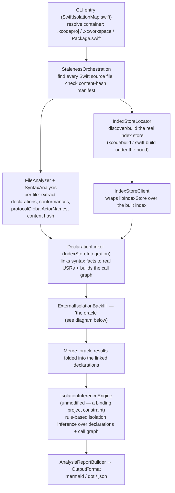
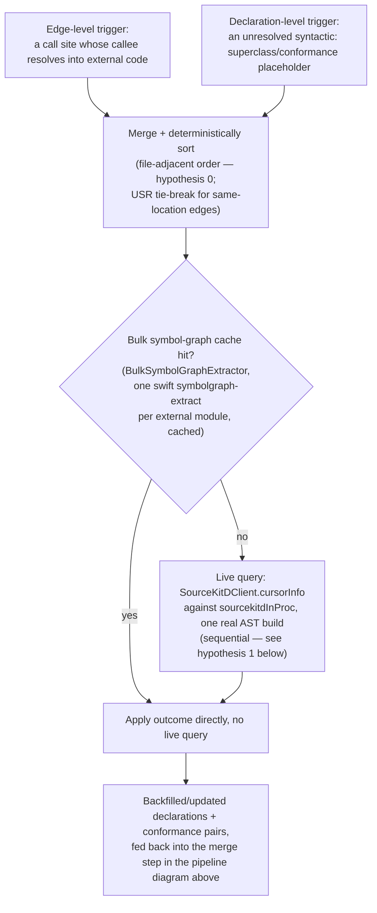

# Docs index

This directory accumulated a long, real research history (spikes, decision records, closed and
still-open tasks) with no single place tying it together. This file is that place: what the tool
actually does, how its pieces fit, and an accurate status for every other doc here — several of
those docs' own `**Status:**` headers are stale (written mid-task, never updated after the work
that closed them landed elsewhere), so treat the table below, not each doc's own header, as
current.

## What this tool does

`swift-isolation-map` statically analyzes a Swift project (Xcode project/workspace or SPM
package) for actor-isolation correctness: which types/functions are isolated to which actor, and
which cross-actor call sites are a real data-race risk under Swift's strict concurrency checking.
See `motivation.md` for why this can't just be "read the compiler's own diagnostics," and
`architecture.md` for the full original project specification (concept, differentiation from
Xcode Instruments, the rule-system-is-the-product principle, distribution, governance) — written
before implementation began and still the reference for "why this shape" on anything not covered
by a later decision record.

Every non-trivial claim in these docs was checked against real code, not synthetic fixtures —
mainly two real projects, described once in `reference-project-corpora.md` rather than repeated
(or leaked, in the private one's case) inline.

## The pipeline, end to end

`IsolationInferenceEngine` is deliberately never modified by any of the work in these docs — every
fix here works by giving it *better input facts* (via `DeclarationLinker` or the oracle), never by
changing its rules. See `isolation-rules.md` for the rule checklist itself.

## The oracle (`ExternalIsolationBackfill.resolve`)

`DeclarationLinker` can only resolve what the index store + syntax analysis already know. Two
real gaps remain after linking: a call into a type from a *compiled, external* dependency (a
CocoaPod, an XCFramework, an SPM binary target — no source, no index entry with useful isolation
info), and a project-local type's own superclass/protocol conformance pointing at such an external
type. The oracle backfills both, real query at a time, only when the fast paths can't already
answer:

The file-adjacent sort order (hypothesis 0 — `hypothesis-0-file-sorted-oracle-queries.md`) and the
sequential-only issuance decision (hypothesis 1) are both real, measured findings — not
assumptions — see the status table below for where each is written up.

## Status of every other doc here

| Doc | What it is | Real current status |
|---|---|---|
| `architecture.md` | The original, pre-implementation project specification | Foundational, kept as-written. Its own "What's changed since this was written" preface (added after a 2026-07-29 audit) lists six concrete gaps — most notably, the external-isolation oracle (arguably the project's largest subsystem) isn't in it at all |
| `motivation.md` | Why this tool exists at all | Foundational, not a task — always current |
| `isolation-rules.md` | Checklist of every isolation-inference rule `IsolationInferenceEngine` implements, plus the runbook for reviewing and adding support for a new Swift version (triggered by `swift-version-watch.yml`) | Living document, updated as rules/versions are added — always current |
| `reference-project-corpora.md` | The two real validation projects (Project Iris, private; SQLumen, public) | Reference doc, added this session |
| `external-dependency-boundaries.md` | How isolation resolution actually treats Pods, SPM, and linked libraries — two mechanisms, not three, and which one applies depends on source availability, not dependency type. Also settles why issue #33 is structurally scoped to source we parse ourselves | Foundational reference doc — always current, cross-references the pipeline/oracle diagrams above rather than duplicating them |
| `research/` | The real research/review paper trail behind the compiled-dependency oracle, Gap A/B, extension-of-external-type isolation, and oracle concurrency — 15 documents, chronological, see `research/README.md` | Historical record, kept close to as-written (redacted for the private project's name only) |
| `priority-2-phase-0-spike.md` | IndexStoreDB dependency de-risking spike | **Closed** — shipped, part of Priority 2 |
| `priority-2-phase-3-linking.md` | USR/location linking decision record | **Closed** — shipped, part of Priority 2 |
| `priority-2-phase-4-cli-wiring.md` | End-to-end CLI wiring, closing Priority 2 | **Closed** — Priority 2 fully shipped |
| `task-compiled-dependency-isolation.md` | Original correctness task (Phases A-F) | **Closed** — own header says "not started," stale; superseded by `priority-3-compiled-dependency-isolation.md` |
| `priority-3-phase-a-compiler-args.md` | Real per-file compiler args, decision record | **Closed** — folded into Priority 3 |
| `priority-3-phase-b-sourcekitd-client.md` | `sourcekitdInProc` client concurrency-model decision | **Closed** — folded into Priority 3 (superseded/re-litigated by hypothesis 1, `task-oracle-query-concurrency.md`) |
| `priority-3-phase-c-oracle-triggers.md` | Oracle trigger sources, decision record | **Closed** — folded into Priority 3 |
| `priority-3-phase-e-fixtures.md` | Golden fixture matrix, decision record | **Closed** — folded into Priority 3 |
| `compiled-dependency-isolation-sourcekit-lsp-spike.md` | `sourcekit-lsp`-as-alternative de-risking spike | **Closed** — de-risking done, informed Phase B's decision |
| `task-compiled-dependency-isolation-performance.md` | Performance task spec (Phases G1-G6) | **Closed** — own header says "not started," stale; superseded by `priority-3-compiled-dependency-isolation.md` |
| `task-compiled-dependency-isolation-usr-granularity.md` | Gap A (accessor USR mismatch) fix + Gap B scoping | **Closed** — Gap A shipped; Gap B superseded by the two docs below, then closed |
| `task-gap-b-implementation-plan.md` | Gap B implementation plan | **Closed** — own header says "plan for review," stale; implemented, result in `priority-3-compiled-dependency-isolation.md`'s Gap B section |
| `task-gap-b-declaration-linker-real-scale.md` | Gap B problem statement | **Closed** — same as above |
| `priority-3-compiled-dependency-isolation.md` | Master closing doc for all of Priority 3 (correctness, performance, Gap A, Gap B) | **Closed** — the authoritative final status for everything it references |
| `task-pods-in-scope-research.md` | Should `Pods`/`Carthage` sources stay in scope? | **Open** — genuinely deferred, a product decision, not yet made |
| `task-external-type-extension-isolation.md` | Extensions of external `@MainActor` types falsely flagged | **Closed** — shipped this session, own header accurate |
| `task-cross-file-type-entry-collision.md` | Cross-file type-entry collision bug | **Closed** — shipped this session, own header accurate |
| `task-oracle-query-concurrency.md` | Hypothesis 0 (query ordering) + hypothesis 1 (concurrent issuance) — the full task + exhaustive decision record | **Closed** — own header says "not yet designed," stale. Hypothesis 0 shipped (PR #15, ~33% faster; see `hypothesis-0-file-sorted-oracle-queries.md` for the readable summary). Hypothesis 1 closed (§7.7) as "don't build": `sourcekitd`'s own `ASTBuildQueue` serializes all AST building process-wide regardless of client concurrency — originally established in `research/12-oracle-concurrency-research-response.md` *before* any spike code, independently reconfirmed against source during closure. `cancel_on_subsequent_request:0` reverted out of production code (only ever needed for the rejected concurrent path) |
| `hypothesis-0-file-sorted-oracle-queries.md` | Standalone summary of hypothesis 0 — what shipped, why, the numbers | **Closed** — shipped, PR #15. Added 2026-07-30 so every other mention of "hypothesis 0" has one clear place to link to instead of the full decision record |
| `retrospective-oracle-query-location.md` | Retrospective on hypothesis 0's own query-location bugs | Closed narrative — always current as a record of what happened |
| `task-default-isolation-detection.md` | SE-0466's `-default-isolation` value is never read from the real project — always resolves `nonisolated` ([issue #30](https://github.com/btctcn/swift-isolation-map/issues/30)) | **Closed** — fixed and shipped (PR #31), verified end-to-end for the SwiftPM path with a real fixture + regression test. The Xcode path uses the same detection code and provider abstraction but was never separately live-spiked against a real `.xcodeproj` — a real, acknowledged residual gap, not assumed equivalent |
| `task-baseof-duplicate-occurrence-collision.md` | Real-world audit against Project Iris: a `DeclarationLinker` bug (duplicate `.baseOf` occurrence wrongly treated as a name collision, silently under-reporting risk) and a known closure-attribution false-positive gap | Bug **fixed**, verified against Project Iris's own real index store + new unit test. Closure-attribution gap documented, **not fixed** — real feature work, out of scope for this pass |
| `task-process-tree-optimization.md` | Parallelize the external-oracle live-query phase (97.6% of real oracle wall-clock) across processes via a new opt-in `--oracle-workers <N>` flag | **Closed** — shipped. Real full-scale Project Iris run: ~1.84× speedup with 4 workers, byte-identical results to sequential (51,087/51,087 nodes, 55,042/55,042 edges). Along the way, found and fixed two real, pre-existing-infrastructure deadlocks in `LiveProcessRunner` (a `Process`/`Pipe` buffer deadlock, then a `DispatchQueue.global()` cooperative-pool-exhaustion deadlock in the first fix's own fix) — both benefit every caller of `ProcessRunning`, not just oracle workers |
| `task-oracle-chunk-balancing.md` | Oracle worker chunks were balanced by item count, not real cost — 5.08× distinct-file-count spread across 8 chunks on Project Iris ([issue #35](https://github.com/btctcn/swift-isolation-map/issues/35)) | **Closed** — shipped. Balancing by distinct file count instead cut the spread to 1.02×; real live-query phase improved 240.1s → 211.5s (~12%, more modest than the balance numbers alone suggest — item count is uneven by design, and each query still carries real fixed per-item cost). Byte-identical to the sequential baseline |
| `task-closure-isolation-attribution.md` | A call inside an isolated closure literal (`Task { @MainActor in }`, `DispatchQueue.main.async`) was misattributed to its enclosing declaration's own isolation, a real false-positive source first found auditing Project Iris ([issue #33](https://github.com/btctcn/swift-isolation-map/issues/33)) | **Closed** — Rules A (accept-list-validated closure-signature attributes) and B (the `DispatchQueue.main` SDK special case) shipped; real-corpus gate against Project Iris: exactly 7 app-code high-risk false positives disappeared, 0 appeared, every retained edge byte-identical. Rule C (the mirror, de-isolating direction) deferred to [issue #41](https://github.com/btctcn/swift-isolation-map/issues/41) (zero measured real-corpus occurrences); resolving accept-list names declared in compiled dependencies deferred to [issue #40](https://github.com/btctcn/swift-isolation-map/issues/40) (same reason) |
| `task-bulk-symbolgraph-inherited-isolation.md` | The external oracle's bulk symbol-graph cache silently resolved any UIKit/AppKit member whose only isolation source is class inheritance as `.nonisolated` -- `symbolgraph-extract` never restates a class's isolation on each inherited member, unlike a live per-declaration query ([issue #44](https://github.com/btctcn/swift-isolation-map/issues/44)) | **Closed** — shipped. Found auditing #33's own real-corpus gate results, unrelated to that fix. Real-corpus re-run against Project Iris: app-code high-risk boundaries went from 228 to 792 (+564), zero disappeared -- the single largest real-world-impact fix found this session |
