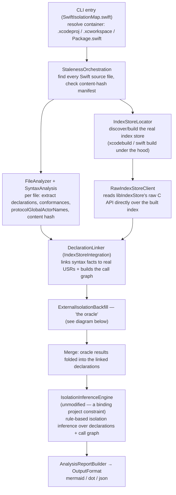
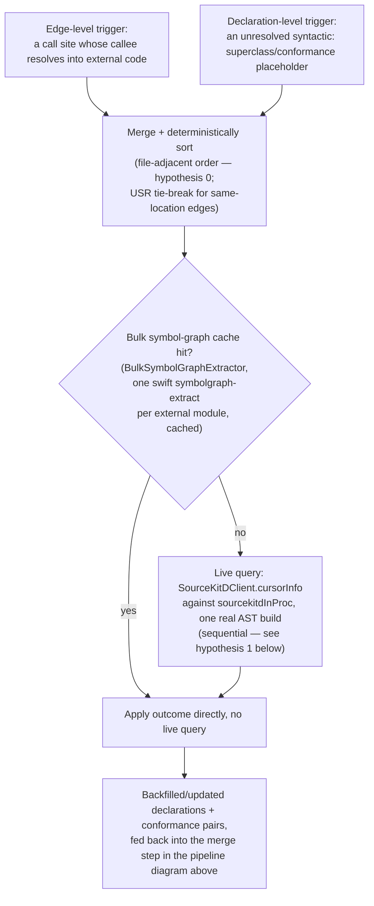

# Docs index

This directory accumulated a long, real research history (spikes, decision records, closed and
still-open tasks) with no single place tying it together. This file is that place: what the tool
actually does, how its pieces fit, and an accurate status for every other doc here — several of
those docs' own `**Status:**` headers are stale (written mid-task, never updated after the work
that closed them landed elsewhere), so treat the table below, not each doc's own header, as
current.

## What this tool does

`swift-isolation-map` statically analyzes a Swift project (Xcode project/workspace or SPM
package) for actor-isolation correctness: which types/functions are isolated to which actor, and
which cross-actor call sites are a real data-race risk under Swift's strict concurrency checking.
See `motivation.md` for why this can't just be "read the compiler's own diagnostics," and
`architecture.md` for the full original project specification (concept, differentiation from
Xcode Instruments, the rule-system-is-the-product principle, distribution, governance) — written
before implementation began and still the reference for "why this shape" on anything not covered
by a later decision record.

Every non-trivial claim in these docs was checked against real code, not synthetic fixtures —
mainly two real projects, described once in `reference-project-corpora.md` rather than repeated
(or leaked, in the private one's case) inline.

## The pipeline, end to end

`IsolationInferenceEngine` is deliberately never modified by any of the work in these docs — every
fix here works by giving it *better input facts* (via `DeclarationLinker` or the oracle), never by
changing its rules. See `isolation-rules.md` for the rule checklist itself.

## The oracle (`ExternalIsolationBackfill.resolve`)

`DeclarationLinker` can only resolve what the index store + syntax analysis already know. Two
real gaps remain after linking: a call into a type from a *compiled, external* dependency (a
CocoaPod, an XCFramework, an SPM binary target — no source, no index entry with useful isolation
info), and a project-local type's own superclass/protocol conformance pointing at such an external
type. The oracle backfills both, real query at a time, only when the fast paths can't already
answer:

The file-adjacent sort order (hypothesis 0 — `hypothesis-0-file-sorted-oracle-queries.md`) and the
sequential-only issuance decision (hypothesis 1) are both real, measured findings — not
assumptions — see the status table below for where each is written up.

## Status of every other doc here

| Doc | What it is | Real current status |
|---|---|---|
| `architecture.md` | The original, pre-implementation project specification | Foundational, kept as-written. Its own "What's changed since this was written" preface (added after a 2026-07-29 audit) lists six concrete gaps — most notably, the external-isolation oracle (arguably the project's largest subsystem) isn't in it at all |
| `motivation.md` | Why this tool exists at all | Foundational, not a task — always current |
| `isolation-rules.md` | Checklist of every isolation-inference rule `IsolationInferenceEngine` implements, plus the runbook for reviewing and adding support for a new Swift version (triggered by `swift-version-watch.yml`) | Living document, updated as rules/versions are added — always current |
| `reference-project-corpora.md` | The two real validation projects (Project Iris, private; SQLumen, public) | Reference doc, added this session |
| `external-dependency-boundaries.md` | How isolation resolution actually treats Pods, SPM, and linked libraries — two mechanisms, not three, and which one applies depends on source availability, not dependency type. Also settles why issue #33 is structurally scoped to source we parse ourselves | Foundational reference doc — always current, cross-references the pipeline/oracle diagrams above rather than duplicating them |
| `research/` | The real research/review paper trail behind the compiled-dependency oracle, Gap A/B, extension-of-external-type isolation, and oracle concurrency — 15 documents, chronological, see `research/README.md` | Historical record, kept close to as-written (redacted for the private project's name only) |
| `priority-2-phase-0-spike.md` | IndexStoreDB dependency de-risking spike | **Closed** — shipped, part of Priority 2 |
| `priority-2-phase-3-linking.md` | USR/location linking decision record | **Closed** — shipped, part of Priority 2 |
| `priority-2-phase-4-cli-wiring.md` | End-to-end CLI wiring, closing Priority 2 | **Closed** — Priority 2 fully shipped |
| `task-compiled-dependency-isolation.md` | Original correctness task (Phases A-F) | **Closed** — own header says "not started," stale; superseded by `priority-3-compiled-dependency-isolation.md` |
| `priority-3-phase-a-compiler-args.md` | Real per-file compiler args, decision record | **Closed** — folded into Priority 3 |
| `priority-3-phase-b-sourcekitd-client.md` | `sourcekitdInProc` client concurrency-model decision | **Closed** — folded into Priority 3 (superseded/re-litigated by hypothesis 1, `task-oracle-query-concurrency.md`) |
| `priority-3-phase-c-oracle-triggers.md` | Oracle trigger sources, decision record | **Closed** — folded into Priority 3 |
| `priority-3-phase-e-fixtures.md` | Golden fixture matrix, decision record | **Closed** — folded into Priority 3 |
| `compiled-dependency-isolation-sourcekit-lsp-spike.md` | `sourcekit-lsp`-as-alternative de-risking spike | **Closed** — de-risking done, informed Phase B's decision |
| `task-compiled-dependency-isolation-performance.md` | Performance task spec (Phases G1-G6) | **Closed** — own header says "not started," stale; superseded by `priority-3-compiled-dependency-isolation.md` |
| `task-compiled-dependency-isolation-usr-granularity.md` | Gap A (accessor USR mismatch) fix + Gap B scoping | **Closed** — Gap A shipped; Gap B superseded by the two docs below, then closed |
| `task-gap-b-implementation-plan.md` | Gap B implementation plan | **Closed** — own header says "plan for review," stale; implemented, result in `priority-3-compiled-dependency-isolation.md`'s Gap B section |
| `task-gap-b-declaration-linker-real-scale.md` | Gap B problem statement | **Closed** — same as above |
| `priority-3-compiled-dependency-isolation.md` | Master closing doc for all of Priority 3 (correctness, performance, Gap A, Gap B) | **Closed** — the authoritative final status for everything it references |
| `task-pods-in-scope-research.md` | Should `Pods`/`Carthage` sources stay in scope? | **Open** — genuinely deferred, a product decision, not yet made |
| `task-external-type-extension-isolation.md` | Extensions of external `@MainActor` types falsely flagged | **Closed** — shipped this session, own header accurate |
| `task-cross-file-type-entry-collision.md` | Cross-file type-entry collision bug | **Closed** — shipped this session, own header accurate |
| `task-oracle-query-concurrency.md` | Hypothesis 0 (query ordering) + hypothesis 1 (concurrent issuance) — the full task + exhaustive decision record | **Closed** — own header says "not yet designed," stale. Hypothesis 0 shipped (PR #15, ~33% faster; see `hypothesis-0-file-sorted-oracle-queries.md` for the readable summary). Hypothesis 1 closed (§7.7) as "don't build": `sourcekitd`'s own `ASTBuildQueue` serializes all AST building process-wide regardless of client concurrency — originally established in `research/12-oracle-concurrency-research-response.md` *before* any spike code, independently reconfirmed against source during closure. `cancel_on_subsequent_request:0` reverted out of production code (only ever needed for the rejected concurrent path) |
| `hypothesis-0-file-sorted-oracle-queries.md` | Standalone summary of hypothesis 0 — what shipped, why, the numbers | **Closed** — shipped, PR #15. Added 2026-07-30 so every other mention of "hypothesis 0" has one clear place to link to instead of the full decision record |
| `retrospective-oracle-query-location.md` | Retrospective on hypothesis 0's own query-location bugs | Closed narrative — always current as a record of what happened |
| `task-default-isolation-detection.md` | SE-0466's `-default-isolation` value is never read from the real project — always resolves `nonisolated` ([issue #30](https://github.com/btctcn/swift-isolation-map/issues/30)) | **Closed** — fixed and shipped (PR #31), verified end-to-end for the SwiftPM path with a real fixture + regression test. The Xcode path uses the same detection code and provider abstraction but was never separately live-spiked against a real `.xcodeproj` — a real, acknowledged residual gap, not assumed equivalent |
| `task-baseof-duplicate-occurrence-collision.md` | Real-world audit against Project Iris: a `DeclarationLinker` bug (duplicate `.baseOf` occurrence wrongly treated as a name collision, silently under-reporting risk) and a known closure-attribution false-positive gap | Bug **fixed**, verified against Project Iris's own real index store + new unit test. Closure-attribution gap documented, **not fixed** — real feature work, out of scope for this pass |
| `task-process-tree-optimization.md` | Parallelize the external-oracle live-query phase (97.6% of real oracle wall-clock) across processes via a new opt-in `--oracle-workers <N>` flag | **Closed** — shipped. Real full-scale Project Iris run: ~1.84× speedup with 4 workers, byte-identical results to sequential (51,087/51,087 nodes, 55,042/55,042 edges). Along the way, found and fixed two real, pre-existing-infrastructure deadlocks in `LiveProcessRunner` (a `Process`/`Pipe` buffer deadlock, then a `DispatchQueue.global()` cooperative-pool-exhaustion deadlock in the first fix's own fix) — both benefit every caller of `ProcessRunning`, not just oracle workers |
| `task-oracle-chunk-balancing.md` | Oracle worker chunks were balanced by item count, not real cost — 5.08× distinct-file-count spread across 8 chunks on Project Iris ([issue #35](https://github.com/btctcn/swift-isolation-map/issues/35)) | **Closed** — shipped. Balancing by distinct file count instead cut the spread to 1.02×; real live-query phase improved 240.1s → 211.5s (~12%, more modest than the balance numbers alone suggest — item count is uneven by design, and each query still carries real fixed per-item cost). Byte-identical to the sequential baseline |
| `task-closure-isolation-attribution.md` | A call inside an isolated closure literal (`Task { @MainActor in }`, `DispatchQueue.main.async`) was misattributed to its enclosing declaration's own isolation, a real false-positive source first found auditing Project Iris ([issue #33](https://github.com/btctcn/swift-isolation-map/issues/33)) | **Closed** — Rules A (accept-list-validated closure-signature attributes) and B (the `DispatchQueue.main` SDK special case) shipped; real-corpus gate against Project Iris: exactly 7 app-code high-risk false positives disappeared, 0 appeared, every retained edge byte-identical. Rule C (the mirror, de-isolating direction) deferred to [issue #41](https://github.com/btctcn/swift-isolation-map/issues/41) (zero measured real-corpus occurrences); resolving accept-list names declared in compiled dependencies deferred to [issue #40](https://github.com/btctcn/swift-isolation-map/issues/40) (same reason) |
| `task-bulk-symbolgraph-inherited-isolation.md` | The external oracle's bulk symbol-graph cache silently resolved any UIKit/AppKit member whose only isolation source is class inheritance as `.nonisolated` -- `symbolgraph-extract` never restates a class's isolation on each inherited member, unlike a live per-declaration query ([issue #44](https://github.com/btctcn/swift-isolation-map/issues/44)) | **Closed** — shipped. Found auditing #33's own real-corpus gate results, unrelated to that fix. Real-corpus re-run against Project Iris: app-code high-risk boundaries went from 228 to 792 (+564), zero disappeared -- the single largest real-world-impact fix found this session |
| `task-indexstore-declaration-completeness.md` | `IndexStoreDB` silently drops a real fraction (803 declarations measured) of a large project's own declarations under full-project load -- resolves correctly in isolation, absent from the final linked result at full scale ([issue #51](https://github.com/btctcn/swift-isolation-map/issues/51)) | **Closed** — mitigation shipped. Root cause not fully isolated (traced to `IndexStoreDB`'s own async/eventually-consistent initialization design, not this project's code); 5 minimal-reproduction attempts all failed, so no upstream report was filed. Extended the existing bulk-then-live-fallback pattern to the project's own declarations (`DeclarationLinker.unresolvedPlaceholders`/`link(_:usrRewriteMapOverrides:)`, `LocalDeclarationLiveFallback`), parallelized across `--oracle-workers` processes (10954 real unresolved placeholders made the sequential path impractical -- 15+ minutes and still running). Real-corpus re-run against Project Iris: the 803 missing declarations dropped to 401, `highRiskBoundaries` rose 853 → 933 (+80) — previously-hidden real risk surfaced, not new noise. The remaining 401 split into two distinct causes, see `task-protocol-requirement-usr-collision.md` below for one of them |
| `task-protocol-requirement-usr-collision.md` | Protocol requirement placeholder USRs collide across unrelated files -- `DeclarationVisitor` has no type-scope for `protocol`, so a requirement's USR discriminator is a bare byte offset, unique only within one file ([issue #53](https://github.com/btctcn/swift-isolation-map/issues/53)) | **Closed** — shipped. Found continuing #51's "401 remaining" follow-up; not `IndexStoreDB` instability at all, a real deterministic bug in this project's own `SyntaxAnalysis` extraction, common with copy-pasted VIPER-style router/view-input protocols (identical boilerplate headers put same-named requirements at identical byte offsets). Real-corpus re-run against Project Iris: total linked declarations 46873 → 47126 (+253), the 401 missing declarations dropped to 361 (-40) |
| `task-implicit-synthesized-declarations.md` | 84% of the remaining 361 missing declarations (default `init()`, `deinit`, `rawValue`/`allCases` accessors) are compiler-synthesized -- no `SwiftSyntax` node exists for them in source text at all ([issue #55](https://github.com/btctcn/swift-isolation-map/issues/55)) | **Documented as a structural limitation, not fixed.** A real fix would mean independently re-deriving the compiler's own synthesis-eligibility rules inside this tool -- judged not worth the false-positive/negative risk for a declaration class that measured zero would-be-high-risk edges on Project Iris. Call sites into these declarations degrade safely to `unspecified` isolation. Also documents a related-but-distinct, still-open sub-finding: bare protocol names (e.g. `Disposable`) extract with `location: nil` for a third, separate reason |
| `task-protocol-own-declaration-location.md` | A protocol's own type-level declaration gets `location: nil` when a same-file default-implementation extension is the only thing that ever creates its `typeIndex` entry -- `TypeIndexBuilder.Visitor` never called `recordPrimaryDeclaration` for `protocol` ([issue #57](https://github.com/btctcn/swift-isolation-map/issues/57)) | **Closed** — shipped. Found continuing #55's Step 6; a third, distinct consequence of the same "protocol has no type-scope" root fact #53 documented, but this one had a real fix (the location was always present in source, just never read). `TypeIndexBuilder.Visitor.visit(_ node: ProtocolDeclSyntax)` now also calls `recordPrimaryDeclaration`, mirroring struct/enum |
| `task-low-risk-same-domain-explanation.md` | `.low` risk explanation always claims "compiler-enforced via await", even for two endpoints in the exact same isolation domain that need no suspension at all ([issue #47](https://github.com/btctcn/swift-isolation-map/issues/47)) | **Closed** — shipped. All 16 real `.low` app-code edges with identical caller/callee isolation are `globalActor(MainActor) -> globalActor(MainActor)`, verified to have no `await` at their call sites. Fix scoped to `.globalActor` only (singleton semantics guarantee "same name = same domain"); `.actor` pairs keep the existing wording since this tool has no actor-instance-identity tracking. Presentation-only -- no risk level or edge count changes |
| `task-await-aware-risk-classification.md` | `riskLevel`/`crossIsolationEdges` are blind to `await` -- a correctly-`await`ed `nonisolated`-caller call into isolated state was classified identically to the same call with no `await` at all ([issue #46](https://github.com/btctcn/swift-isolation-map/issues/46)) | **Closed** — shipped as a new, purely informational `isAwaited` field on `AnalysisEdge`, *not* a `risk` change. The issue's own original proposal (downgrade an awaited `.high` edge to `.low`) was implemented first, found to directly contradict this project's own real golden-fixture ground truth (`CompiledDependencyCLITests.swift`'s Mechanism A: a real, compiling, already-awaited call is deliberately still `.high` -- it tracks migration debt, not just unguarded races), and reverted in favor of the scoped-down design |
| `task-deinit-extraction-gap.md` | An explicit `deinit` was never extracted as a declaration at all -- `DeclarationVisitor` had no `visit(_ node: DeinitializerDeclSyntax)` override, so every deinit's caller isolation silently resolved `unspecified` ([issue #48](https://github.com/btctcn/swift-isolation-map/issues/48)) | **Closed** — shipped. The issue's own original hypothesis (`IndexStoreDB` reporting two different USRs for the same `@objc`-visible override) was disproven by a direct probe against the real index store -- definition and call-site agreed on the identical USR. Real root cause: a plain missing `SwiftSyntax` visitor override, the same category as #53 but for `deinit`. Real-corpus re-run: `crossActorBoundaries` 24852 → 24801 (-51), `unspecifiedIsolation` 1501 → 1458 (-43), `highRiskBoundaries` unchanged (real noise removed, not risk hidden) |
| `task-objc-enum-accessor-linking.md` | A top-level `@objc` enum's synthesized `rawValue`/`allCases` accessors link under its Clang USR, not its Swift-mangled USR -- found chasing the `MindboxLogger`/`DeviceKit` cluster `docs/task-subscript-and-compressed-constant-matching.md` §5 set aside | **Closed.** The matching fix (`SynthesizedEnumAccessorMatching.enclosingObjCEnumUSR`) shipped and is correct for its own confirmed shape, but measured zero real-corpus impact on the specific case that motivated it on its own -- tracing why surfaced a deeper, pre-existing `DeclarationLinker` bug, fixed separately in `task-syntactic-placeholder-name-collision.md` (issue #95); combined, the two fixes fully resolve the `MindboxLogger.LogLevel` cluster |
| `task-syntactic-placeholder-name-collision.md` | `DeclarationLinker`'s bare-name `syntactic:<Name>` placeholder collides across genuinely different, unrelated real declarations sharing a name -- silently merges them into one `byUSR` entry ([issue #95](https://github.com/btctcn/swift-isolation-map/issues/95)) | **Closed** — shipped. A declaration's own identity now resolves via its own location directly (`ownUSRByLocation`) instead of the shared, collision-prone name-keyed map. Real-corpus re-run against Project Iris: external oracle unknown 1573 → 1512 (-61), unresolved edges 106 → 97 (-9, 5.7% → 5.3%), `highRiskBoundaries`/`mainActorTypes`/`typesAnalyzed` unchanged. Measured standalone (-60 unknown) before combining with `task-objc-enum-accessor-linking.md`'s own fix, confirming broader real-corpus impact than just the `LogLevel` cluster that led to finding it |
| `task-sc-constant-and-hashable-accessor-matching.md` | Two more matching fixes: the `"SC"` (plain-C) module-code variant of a top-level imported constant, and `Hashable.hashValue`'s synthesized default-witness accessor | **Closed** — shipped. Real-corpus re-run against Project Iris: external oracle unknown 1512 → 1500 (-12), unresolved edges 97 → 81 (-16, 5.3% → 4.4%), `highRiskBoundaries`/`mainActorTypes`/`typesAnalyzed` unchanged |
| `task-demangled-sibling-matching.md` | Resolves `MultiTargetDeclarationAliasing`'s own documented "compression-divergence" limitation via real `swift-demangle` output instead of re-deriving Swift's mangling algorithm | **Closed** — shipped. Real-corpus re-run against Project Iris: external oracle unknown 1500 → 1481 (-19), unresolved edges 81 → 46 (-35, 4.4% → 2.5%), `highRiskBoundaries` unchanged. Largest single edge-count drop this whole investigation. Remaining `_Release`-qualified USRs are the already-documented, already-accepted issue #55 shape (synthesized declaration, no location anywhere) |
| `task-remaining-matcher-batch.md` | Four more matching fixes (pure-Swift static member accessor, ObjC instance property accessor, compound-identifier struct member, Optional-returning compressed constant), plus explicit investigated-and-set-aside dispositions for what's left | **Closed** — shipped. Real-corpus re-run against Project Iris: external oracle unknown 1481 → 1472 (-9), unresolved edges 46 → 28 (-18, 2.5% → 1.6%). Every remaining cluster (`AsyncOperation` KVO selectors, `NSMutableDictionary`'s `NSCopying`-keyed subscript, `MKCoordinateRegion.center`'s typealias-wrapped setter, 8 already-documented issue #55 synthesized declarations) investigated with real evidence and explicitly left unresolved rather than guessed at |
| `task-raw-indexstore-spike.md` | Scoped spike (issue #51): does bypassing `IndexStoreDB`'s async/LMDB layer via `libIndexStore`'s raw C API fix the declaration-loss root cause? | **Shipped, but not for the original reason.** The hypothesis didn't hold (295 vs. 296 missing declarations in a controlled A/B -- noise). Investigating a real ~13% call-graph edge disagreement instead surfaced a bigger, separate `IndexStoreDB` gap: `symbolOccurrences(inFilePath:)` silently drops occurrences from every target but one, for a file compiled into more than one (an app + its extensions -- Project Iris's own real shape; one file alone: 72 → 216 declarations). Confirmed with a minimal, two-`swiftc`-invocation, project-independent reproduction, filed as [swiftlang/indexstore-db#292](https://github.com/swiftlang/indexstore-db/issues/292). `RawIndexStoreClient` (`Sources/CIndexStoreRaw/`, `Sources/IndexStoreIntegration/RawIndexStoreClient.swift`) now replaces `IndexStoreClient` as the default index reader -- a real regression (an ObjC property/setter USR canonicated incorrectly) was found and fixed along the way, caught by the existing golden-fixture test suite. **Bonus finding**: re-running issue #49's own dirty-vs-clean-DerivedData experiment with the new client found *zero* edge-set difference (was 8588/5736 out of ~44-48k with `IndexStoreDB`) -- see #49's own follow-up comment |
| `task-sourcekitd-cooperative-pool-starvation.md` | Real intermittent Swiftfin live-fallback failures, root-caused (§8) to a `compilerArguments` caching bug unrelated to `sourcekitd`; §9-10 close out issue #125's two loose ends and harden total-sourcekitd-unavailability handling; §11 points at the later, separate fixes for issue #142 | **Closed** — shipped (PR #143). §9: shared `SourceKitDClient` (was two, double-`sourcekitd_initialize()`, documented UB). §10: total sourcekitd unavailability is now a hard failure (`exit(2)`), not a silent fail-soft report missing all external-dependency isolation data. Issue #125's second loose end (separate oracle-query non-determinism) split out into [issue #142](https://github.com/btctcn/swift-isolation-map/issues/142) -- now closed, see `task-swiftpm-compiler-args-retry-threshold.md` and `task-swiftfin-oracle-nondeterminism-reconfirmation.md` |
| `task-swiftpm-compiler-args-retry-threshold.md` | `LiveSwiftPMCompilerArgumentsProvider`'s single `swift build -v` parse is not stable across repeated invocations with zero source changes -- an incremental build silently omits compile lines for already-up-to-date targets, a real, independent contribution to issue #142's own oracle-query non-determinism symptom, distinct from the original Xcode-path (Swiftfin) evidence | **Closed** — the SwiftPM-path mechanism is fixed (retry with `swift package clean` when the parse looks suspiciously incomplete, threshold scaled to the real project's own file count, not a fixed number -- a fixed floor alone regressed a real, tiny test fixture, found and fixed in the same pass). Real-corpus verified: this project's own self-analysis, 4 consecutive runs, byte-identical (`476 resolved, 193 unknown` every time) -- was swinging between ~304-391 and ~473-192 before. The Xcode-path (`SwiftBuildCompilerArgumentsProvider`) Swiftfin variance is a different mechanism, not explained or touched by this fix -- see `task-swiftfin-oracle-nondeterminism-reconfirmation.md` for that half |
| `task-swiftfin-oracle-nondeterminism-reconfirmation.md` | Issue #142's own original Xcode-path evidence (Swiftfin, ~1-in-7 runs disagreeing) -- does it still reproduce, now that the SwiftPM-path mechanism is fixed and several later, unrelated compiler-argument fixes have shipped? | **Closed** — investigated, not reproducible. Also corrected a stale claim along the way: Swiftfin was never actually environment-blocked (`docs/task-multi-platform-target-support.md`'s own "confirmed independent environment issue" was really just a missing `-skipMacroValidation`, the same real Xcode macro-security gate that flag already exists for). 7 repeated real runs against Swiftfin (matching the original finding's own sample size), one fresh index then six reusing it: byte-identical every time, at both the summary and full node-set level. No new hypothesis chased for *why* -- matches this project's own `AsyncOperation.setExecuting:`/`setFinished:` precedent (`task-remaining-matcher-batch.md` §8) for a finding that no longer reproduces on a real, actively-changing corpus. Issue #142 closed as "not currently reproducible" |
| `task-nscopying-keyed-subscript-matching.md` | `NSDictionary`/`NSMutableDictionary["key" as NSCopying]`'s subscript accessor USR has no `"cip"`-suffixed bulk-cache entry to rewrite to, unlike the generic `Any`-keyed form issue #94 already resolves ([issue #126](https://github.com/btctcn/swift-isolation-map/issues/126)) | **Closed** — shipped. Re-extracting Foundation's own symbolgraph *structurally* (by `pathComponents`, not by text-searching for "NSCopying") found what issue #126's original text search missed: the getter's underlying Clang method (`objectForKeyedSubscript:`) is present, keying the *whole* get(+set) pair, once per container. `BridgedKeyedSubscriptMatching` bridges both accessor forms to that one fixed USR. Real-corpus A/B on Project Iris: exactly 2 node diffs (`unspecified` → `nonisolated`), external oracle unknown -2, `unspecifiedIsolation` -2, `highRiskBoundaries` unchanged |
| `task-typealias-wrapped-struct-member-matching.md` | `MKCoordinateRegion.center`'s setter carries the same typealias marker (`"a"`) as a genuinely class-rooted case (`NSAttributedString.Key.font`) -- `DemangledStructMemberMatching`'s bulk-cache gate can't safely widen to accept it ([issue #127](https://github.com/btctcn/swift-isolation-map/issues/127)) | **Closed** — shipped. A temporary debug probe found the real blocker was never isolation-attribute detection (a live query already resolves inherited isolation safely, struct or class) -- only *candidate selection*: the live query's own Clang-form USR (`c:@SA@MKCoordinateRegion@FI@center`) never strictly equals the call graph's Swift-mangled `targetUSR`. `TypealiasWrappedStructMemberMatching`, mirroring `ObjCProtocolPropertyWitnessMatching`'s own design, bridges the two. Real-corpus A/B on Project Iris: exactly 1 node diff (`unspecified` → `nonisolated`), `highRiskBoundaries` unchanged |
| `task-target-environment-mac-catalyst.md` | `isActiveTargetEnvironment` unconditionally answered `true` for any name, unconfirmed against any real corpus at the time ([issue #139](https://github.com/btctcn/swift-isolation-map/issues/139)) | **Closed** — shipped. A re-swept corpus set (this time including Pods) found `IceCubesApp`/`home-assistant-iOS` gate whole real files on `#if os(iOS) && !targetEnvironment(macCatalyst)` -- the old `true` answered this backwards (`!true == false`), silently excluding them. Fixed with an architecture-confirmed answer (not corpus-inferred): `resolveDeterministicSimulatorDestination` structurally never selects Mac Catalyst, so `"macCatalyst"` is confirmed always inactive for `.iOS`/`.tvOS`/`.watchOS`. Real-corpus A/B on Project Iris: a real Kingfisher `CPListItem+Kingfisher.swift` file (CarPlay-gated) recovered, 14 added nodes, `highRiskBoundaries` unchanged |
| `task-platform-flag-multi-destination-scheme.md` | A modern multiplatform SwiftUI scheme (`IceCubesApp`) offers several simultaneously-valid Simulator destinations on *one* scheme (iOS, visionOS) -- `resolveDeterministicSimulatorDestination` always picked whichever `xcodebuild` listed first, with no way to ask for a different one ([issue #140](https://github.com/btctcn/swift-isolation-map/issues/140)) | **Closed** — shipped. Added `--platform <name>`, threaded consistently through all three real destination-resolution call sites (a `--platform visionOS` run resolving compiler args for visionOS while still bulk-extracting symbol-graph data for iOS would be a real, silent inconsistency). A genuinely unavailable platform throws with the real available list, never silently falling back. Verifying against `IceCubesApp` found a second real gap: `TargetPlatform` had no `.visionOS` case at all, so a correctly-resolved visionOS destination still fell back to platform-blind `#if` extraction -- fixed by adding it, plus visionOS's real (Apple-internal) target-triple OS component `"xros"`, confirmed via a real `swiftc -target arm64-apple-xros1.0-simulator` compile. Real-corpus A/B on Project Iris (default, no `--platform`): zero added/removed/changed nodes |
| `task-cross-file-witness-fixture-race.md` | `DeclarationLinkerTests.swift`'s three remaining tests (of six) still built directly into the shared `Tests/Fixtures/cross-file-witness/.build`, racing `RawIndexStoreClientModuleScopingTests.swift`'s own concurrent build of the same directory under Swift Testing's default parallel execution ([issue #148](https://github.com/btctcn/swift-isolation-map/issues/148)) | **Closed** — shipped. Converted the three unsafe tests to the already-existing, already-proven-safe `copiedCrossFileWitnessFixture()` helper (used by the file's other three tests and by `RawIndexStoreClientModuleScopingTests.swift`/`ExternalIsolationBackfillTests.swift` since PR #128) -- no test in the repo now builds into the shared fixture root. Pure test-infrastructure, no production code changed. Verified via the issue's own exact repro command, 3 consecutive runs, 10/10 passing every time, zero flakes |
| `glossary.md` | Every acronym/tool-name/term used across this project's docs, explained in one place | Foundational/reference, not a task — always current |
| `task-anonymous-context-mangled-names-noise.md` | `-enable-anonymous-context-mangled-names` diagnostic noise flooding stderr on real live-fallback queries | **Closed** — fixed at the root cause (2026-08-30): `CompilerArgumentsSanitizing.sanitized(_:)` now drops the literal `-g` token (the real trigger condition, per `swiftlang/swift` source), not just the symptom. Real Project Iris A/B: 52 → **0** diagnostic occurrences, and a real bonus — 10 new, previously-hidden `OSLogInterpolation` edges surfaced |
| `task-bridged-extern-class-constant-isolation.md` | `UITableView.automaticDimension`/`UIResponder.keyboardWillShowNotification`-style class-exposed extern constants (Swift mangling marker `"C"`, arbitrary return type) unresolved — a sibling gap to `BridgedExternConstantMatching`'s typealias-wrapper case | **Closed** — shipped as `BridgedExternClassConstantMatching`, PR #89. Real Project Iris A/B: external oracle unknown 1827 → 1804 (-23), unresolved edges 38% → 32% |
| `task-bridged-extern-function-property-isolation.md` | `CGImageRef.width`/`.height`-style CoreFoundation opaque-pointer properties, bridged from a plain Clang C function (`CGImageGetWidth`), unresolved | **Closed** — shipped as `BridgedExternFunctionPropertyMatching`. Real Project Iris A/B: external oracle unknown 1609 → 1594 (-15), unresolved edges 22% → 21%. Session-wide summary table: nine independent matching fixes took unresolved edges from 74% to 21% over this whole investigation |
| `task-bulk-extraction-wrong-platform.md` | Real `xcodebuild` compile errors (`no such module 'AppKit'`/`'WatchKit'`) during bulk symbol-graph extraction on Project Iris, plus a much-higher-than-expected `isUnknown` rate | **Closed** — four independent findings (§2 bulk extraction ignoring `-destination`, §5 `DeclarationExtractor`'s platform-blindness to `#if`/`canImport`, §7 the `.unknown`-platform correction, §8 phantom `setXXX:` edges for read-only ObjC properties), each fixed and verified. Real Project Iris progression: 73% → 74% (denominator shift, not a regression) → **67%** unresolved after §8 alone (-1102 cross-isolation edges) |
| `task-custom-condition-evaluation.md` | Issue #121: does real `#if <name>` custom-condition evaluation (beyond the hardcoded-permissive default) matter on a real corpus? | **Closed** — shipped as PR #134. `isCustomConditionSet` now reads real `-D`/`-Xcc`-aware compiler args instead of answering unconditionally `true`. Real Project Iris result: 3 phantom declarations correctly removed, 1 real declaration (`AnyPromise.description`) correctly recovered — both directions of risk this mechanism exists to guard against, confirmed real on the same corpus |
| `task-declaration-linker-stray-duplicate-tiebreak.md` | Issue #123: `DeclarationLinker`'s same-USR merge has no tie-break defense against a stray Finder-duplicate file (`" 2.swift"`) winning a merged declaration's `location` | **Closed** — fixed at the root cause: `merged(_:_:filesWithIndexedSymbols:)` now prefers whichever candidate's file has real indexed symbols, reusing data `DeclarationLinker` already computes for an unrelated guard. No production real-corpus re-run (the 22 triggering stray files were already removed from Project Iris as data hygiene) — verified via 3 new unit tests reproducing the exact historical shape instead. 596/596 tests passing |
| `task-escape-hatch-and-preconcurrency-severity.md` | Issue #117: teams can be "passing" Swift 6 strict concurrency while relying on `@unchecked Sendable`/`nonisolated(unsafe)`/`@preconcurrency`, invisible to the report; no structured severity-downgrade reasoning either | **Closed** — shipped as PR #118 (shapes 1-3, declaration-trigger severity downgrade) + PR #119 (shape 4, `@preconcurrency import`, via `sourcekitd`'s `key.modulename` field). Real-corpus verified across five corpora (Project Iris, Kingfisher, Auth0.swift, RealmSwift, WCDB), finding and fixing two independent real bugs along the way (7 `DeclarationInfo` reconstruction sites silently dropping the new fields; a superclass-vs-protocol heuristic misclassifying an attribute-only inheritance-clause entry). Four items deliberately deferred, tracked as [issue #153](https://github.com/btctcn/swift-isolation-map/issues/153) |
| `task-extern-constant-swift-name-usr-mismatch.md` | `NSAttributedString.Key.font`/`.kern`/etc. (1007 real edges, ~20% of residual `isUnknown` post-PR #84) unresolved — a Swift-bridged static-member USR that `cursorinfo` never resolves, only the raw underlying Clang extern-constant USR | **Closed** — shipped as `BridgedExternConstantMatching`, PR #86, after an extensive (13-section) empirical investigation ruling out four different sourcekitd-query-based recovery avenues before landing on a grammar-based matcher. Real Project Iris impact: this family's own `isUnknown` count, 1007 → **0** |
| `task-external-plugin-path-noise.md` | Issue #135: `-external-plugin-path`/`-plugin-path` stderr noise (6269-6921 occurrences per run), appearing only after the `-g`-stripping fix (#133) | **Closed** — root-caused via direct `lldb` breakpoints (not just source reading) to `-Xcc`/`-Xfrontend` token orphaning in `CompilerArgumentsSanitizing.sanitized(_:)`: dropping only the trailing token of a multi-token unit let the `-Xcc`/`-Xfrontend` before it swallow the next real token. Fixed by removing the whole real unit atomically. Real Project Iris A/B: recovers a genuine 10-edge, 2-`unspecifiedIsolation` discrepancy a first, blanket-strip attempt had been silently hiding. 593/593 tests passing |
| `task-imported-c-struct-isolation.md` | `CGSize`/`CGRect`/`CGPoint`/`UIEdgeInsets` field access and `UIControlState`/`UIControlEvents` case constants — raw imported C struct fields invisible to `symbolgraph-extract` entirely | **Closed** — shipped as `ImportedStructMemberMatching`. By far the largest single jump in the whole `isUnknown`-reduction investigation: real Project Iris A/B, external oracle unknown 2008 → 1827 (-181), unresolved edges 65% → **38%** (-27pp) |
| `task-external-property-accessor-usr-mismatch.md` | Objective-C property accessors (`UIView.leadingAnchor`, `UILabel.setText:`, etc.) dominating a real corpus's residual `isUnknown` count — a Clang-level accessor USR vs. the Swift-visible property's own USR | **Closed** — shipped as PR #82 (`owningPropertyUSR` extended to reference-role occurrences, plus `@CM@<Module>@@`-qualifier stripping on the call-graph-edge path). Real Project Iris impact: cross-actor boundaries 25369 → 8173 (-68%), uncertain edges 24030 → 6264 (-74%). §9's multi-corpus follow-up found a second, still-unhandled single-`@` qualifier shape; a 2026-09-05 re-check found real single-`@` property USRs in the wild (Mindbox `@NSManaged` Core Data properties) but confirmed none of them ever reach the oracle path this gap concerns — still no live case found, no issue filed |
| `task-imported-top-level-constant-isolation.md` | Plain, non-member Clang `extern const` globals (`NSCocoaErrorDomain`, CoreText/CoreTelephony/Contacts constants) with no containing type to key a bulk-cache entry by | **Closed** — shipped as `ImportedTopLevelConstantMatching`, with a load-bearing false-positive guard found during design (a genuine class property, `UISceneConnectionOptions.shortcutItem`, also ends in the same mangled suffix). Real Project Iris A/B: external oracle unknown 1804 → 1630 (-174), unresolved edges 32% → 24% |
| `task-index-store-module-scoping.md` | Shared Xcode index store (`~/Library/Developer/Xcode/DerivedData`) accumulates units from unrelated builds/schemes, fabricating real-looking cross-isolation edges from targets never part of the analyzed scheme | **Shipped, but superseded as the default.** The `is_system_unit`-based module-name exemption fixed and verified on Project Iris (Step 6), but `docs/task-private-derived-data-hypothesis.md` later solved the same problem structurally (a private, never-shared DerivedData), which is now the tool's actual default for Xcode projects; this fix's code stays as a narrower `--experimental-index-store-module-filter` fallback. Its own 27-edge non-modular-ObjC residual only affects that fallback path today, tracked as [issue #155](https://github.com/btctcn/swift-isolation-map/issues/155) |
| `task-multi-platform-target-support.md` | Issue #124: `SwiftBuildCompilerArgumentsProvider` hardcoded to iOS Simulator at three points, silently discarding tvOS/watchOS/visionOS target compiler arguments | **Closed** — shipped as `SimulatorSDKFamily`, generalizing to all four real Simulator SDK families. Verified against four independent real corpora: Project Iris (zero regression), Swiftfin (tvOS platform now correctly detected; the full run's own "environment issue" claim made at the time was later found to be a plain missing `-skipMacroValidation` flag, not a real environment blocker — see `docs/task-swiftfin-oracle-nondeterminism-reconfirmation.md`), home-assistant/iOS (watchOS — full real run, 606/606 targets resolved), IceCubesApp (visionOS — found a second, distinct gap: a single scheme offering several simultaneously-valid destinations, later closed by issue #140/PR #147) |
| `task-multi-target-aliasing-doc-staleness.md` | Issue #122: is `MultiTargetDeclarationAliasing`'s mangling-substitution-compression gap still open? | **Closed** — resolved as a stale doc comment only, no functional change: the gap was already closed by `DemangledSiblingMatching` (PR #99), `MultiTargetDeclarationAliasing.swift`'s own doc comment had simply never been updated to say so. Fixed the comment to state the real, current picture |
| `task-multi-target-declaration-aliasing.md` | The same source file compiled into multiple Xcode targets (main app + 2 extension targets) produces multiple module-qualified USRs for one physical declaration, only one of which ever links | **Closed** — shipped as `MultiTargetDeclarationAliasing`, a zero-live-query suffix-index match exploiting the fact a Swift USR's module-name component is always the first length-prefixed identifier after `"s:"`. Real Project Iris A/B: external oracle unknown 1594 → 1588 (-6); the real win is correctness on previously-mislabeled `isUnknown: true` edges, not raw count |
| `task-objc-protocol-property-witness-isolation.md` | `UITextField.keyboardType`/`.autocorrectionType`/etc. — a concrete class witnessing (not declaring) a property via ObjC protocol conformance, keyed by the protocol's own USR everywhere except the call graph | **Closed** — shipped as `ObjCProtocolPropertyWitnessMatching`, deliberately never comparing the member's own name (found a real, asymmetric `is`-prefixed-boolean-setter case, `setSecureTextEntry:`/`isSecureTextEntry`, that a naive name-strip would get wrong). Real Project Iris A/B: external oracle unknown 1630 → 1609 (-21), unresolved edges 24% → 22% |
| `task-own-module-declaration-gaps.md` | Three unrelated causes of false `isUnknown` for 100%-project-local declarations: synthesized `rawValue`/`allCases` accessors, an empty-body protocol with no same-file extension, and stray Finder-duplicate `" 2.swift"` files poisoning `DeclarationLinker`'s type merge | **Closed** — first two code-fixed (`SynthesizedEnumAccessorMatching`, a new `ProtocolDeclSyntax` visit), third resolved as real-corpus data hygiene (22 stray files removed, not a code change — documented as a known, still-real `DeclarationLinker` merge risk for any future corpus, later mitigated by `task-declaration-linker-stray-duplicate-tiebreak.md`). Real Project Iris combined impact: external oracle unknown 2498 → **2008** (-19.6%), the stray-file cleanup alone contributing the large majority |
| `task-private-derived-data-hypothesis.md` | Rather than filtering the shared Xcode DerivedData after the fact, give the tool its own private, composite-keyed (project+scheme+destination+configuration) DerivedData that can never accumulate another build's units by construction | **Shipped as the default** for Xcode projects (the old `allowedModuleNames`/`is_system_unit` filtering is what's now gated behind an experimental flag, not this). Real Project Iris verification landed within 5 edges of the historical "known good" baseline with zero filtering logic at all. Three items left open (a 32-edge unexplained residual, no second-corpus re-verification, an unreproduced first-use `BUILD FAILED`), tracked as [issue #156](https://github.com/btctcn/swift-isolation-map/issues/156) |
| `task-subscript-and-compressed-constant-matching.md` | Two independent shapes: `NSDictionary`/`NSMutableDictionary` subscript accessor-vs-declaration USR mismatch, and `NSURLResourceKey` members defeating `BridgedExternConstantMatching`'s strict grammar via Swift mangling substitution compression | **Closed** — shipped as `SubscriptAccessorDeclarationMatching` + `BridgedExternConstantContainerMatching`, batched per an explicit process change (per-fix corpus runs had become the dominant cost). By far the largest *percentage* jump in the investigation: real Project Iris A/B, unresolved edges 21% → **5.7%**; the tool's own "anomalously high uncertainty" warning stopped firing entirely |
| `task-suppression-comments.md` | Design (v0.2) for a `// swift-isolation-map:ignore-high("reason")`-style per-call-site suppression comment, as an alternative to a real Swift macro | **Decision: will not be implemented.** Design-only, kept as the record of a considered-and-rejected option; removed from the README Roadmap |
| `task-swift-build-prepare-for-indexing-spike.md` | Does driving `swift-build`'s `SwiftBuild` API directly, bypassing `xcodebuild -showBuildSettingsForIndex`'s own closed-source platform-selection bug, fix the WordPress-iOS divergence (834 edges) that motivated this spike? | **Closed, shipped, and promoted to the unconditional default** (`--experimental-swift-build-compiler-args` removed entirely, PR #107 + later Step 27). Root cause found and fixed (`LiveXcodeCompilerArgumentsProvider`'s missing home-directory signal), reducing WordPress-iOS's divergence 834 → 14 (98.3%); the 14-edge (WordPress-iOS) / 26-edge (Project Iris) residuals are understood, accepted as non-bugs (an honest `isUnknown` disagreement for files with no target-named home directory), and the one remaining consistency improvement (sorting fallback candidates deterministically) is tracked as [issue #154](https://github.com/btctcn/swift-isolation-map/issues/154) |
| `task-xcodebuild-show-build-settings-for-index-spike.md` | Spike: does `xcodebuild -showBuildSettingsForIndex` give real per-file compiler arguments without an actual (re)compile, avoiding the clean-rebuild-retry cost `LiveXcodeCompilerArgumentsProvider` pays on every invocation? | **Closed, not adopted.** Confirmed real and ~40x faster, but with a disqualifying, *confirmed* (not hypothetical) platform-selection bug: the flag silently returns device-flavored compiler arguments regardless of destination override, traced to `xcodebuild`'s own closed-source CLI-to-`BuildRequest` translation. A full real Project Iris pipeline run wired to this spike nearly tripled `crossActorBoundaries` (1790 → 5103) and inflated `unspecifiedIsolation` 6.7x, almost entirely spurious noise. Superseded/mooted by `docs/task-swift-build-prepare-for-indexing-spike.md`'s own direct `swift-build` API path, which sidesteps the buggy CLI translation entirely |
| `upstream-issue-indexstore-db-multitarget.md` | `IndexStoreDB.symbolOccurrences(inFilePath:)` silently returns occurrences from only one compiling target when a source file is shared across multiple targets (app + extension, routine iOS/macOS architecture) | Filed upstream as [swiftlang/indexstore-db#292](https://github.com/swiftlang/indexstore-db/issues/292), with a fix submitted as [PR #293](https://github.com/swiftlang/indexstore-db/pull/293) ("Fixes #292", full regression-tested). **Open, unreviewed as of 2026-09-05** — PR #293 opened 2026-08-10, no maintainer activity since. This project's own `RawIndexStoreClient` (bypassing `IndexStoreDB` entirely) is unaffected by the bug either way |
